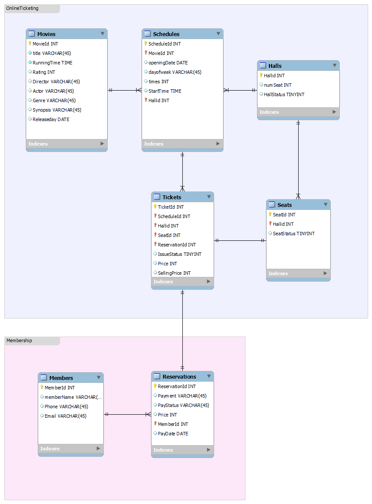

# 영화관 예매 시스템

한 줄 소개: 영화관 DB 구축 및 예약 관리 시스템 구현  
진행 기간: 2022년 5월 24일 → 2022년 6월 7일  
Skills: JAVA, MySQL  
팀 구성: 개발자 1, 보고서 작성 1  
관련활동: 데이터베이스

**요약**

- 영화관 DB 구축
- 예매 시스템 구현
- 2022-1학기 데이터베이스 과목 Team Project

**역할**

- 개발 담당, 영화관 DB 구축 및 예약 관리 시스템 구현

**진행기간**

- 2022.05.24 ~ 2022.06.07

---

### 프로젝트 상세 내용

### 사용 기술 
언어: SQL, Java  
프레임워크: MySQL, Eclipse  
스키마 도구: MySQL EER Diagram

### 협업 관리 도구
- Git

---

### 구현 제약 사항
- 인터넷 영화 예약을 위한 예약 관리 시스템 개발
- 관리자, 회원 역할을 선택하여 이용 가능
- GUI는 Java의 Swing 사용 (과제 지시 사항)

### 핵심 기능

- 관리자와 회원 기능 분할하여 기술

**관리자 기능**

1. DB 초기화 기능
2. 전체 데이터 조회 기능
3. 영화 데이터 입력, 삭제, 변경 기능
4. 예매 내역 삭제 및 변경 기능

**회원 기능**

1. 영화 상영 목록 조회 기능
2. 영화 예매 기능
3. 예매 내역 삭제 및 변경 기능

### 담당 업무

- DB Schema 구축
- 샘플 데이터 삽입
- SQL 명령어 작성
- Java Swing GUI 구축
- DB 연동 예약 관리 시스템 구현
- 테스트 케이스 작성

---

**DB Schema**

**Movies** (MovieId, title, RunningTime, Rating, Director, Actor, Genre, Synopsis, Releaseday)  
**Schedules** (ScheduleId, MovidId, Hallid, OpeningDate, dayofweek, times, startTime)  
**Halls** (Hallid, numSeat, HallStatus)  
**Tickets** (TicketId, ScheduleId, Hallid, SeatId, ReservationId, IssueStatus, Price, SellingPrice)  
**Seats** (SeatId, Hallid,SeatStatus)  
**Members** (MemberId, memberName, Phone, Email)  
**Reservations** (ReservationId, Payment, PayStatus, Price, MemberId, PayDate)  

**Movies** – Schedules (1:n)  
**Halls** – Schedules (1:n)  
**Schedules** – Tickets (1:n)  
**Halls** – Seats (1:1)  
**Tickets** – Seats (1:1)  
**Tickets** – Reservations (1:1)  
**Members** – Reservations (1:n)  

---

### 서비스 화면

- 관리자, 초기화 화면

- 관리자, 영화 및 예매 데이터 입력 화면

- 관리자, 영화 및 예매 데이터 삭제 화면

- 관리자, 영화 및 예매 데이터 변경 화면

  

- 관리자, 영화 및 예매 데이터 조회 화면

- 회원, 영화 정보 조회 화면

- 회원, 영화 예매 화면

- 회원, 예매 내역 조회 및 변경 화면
